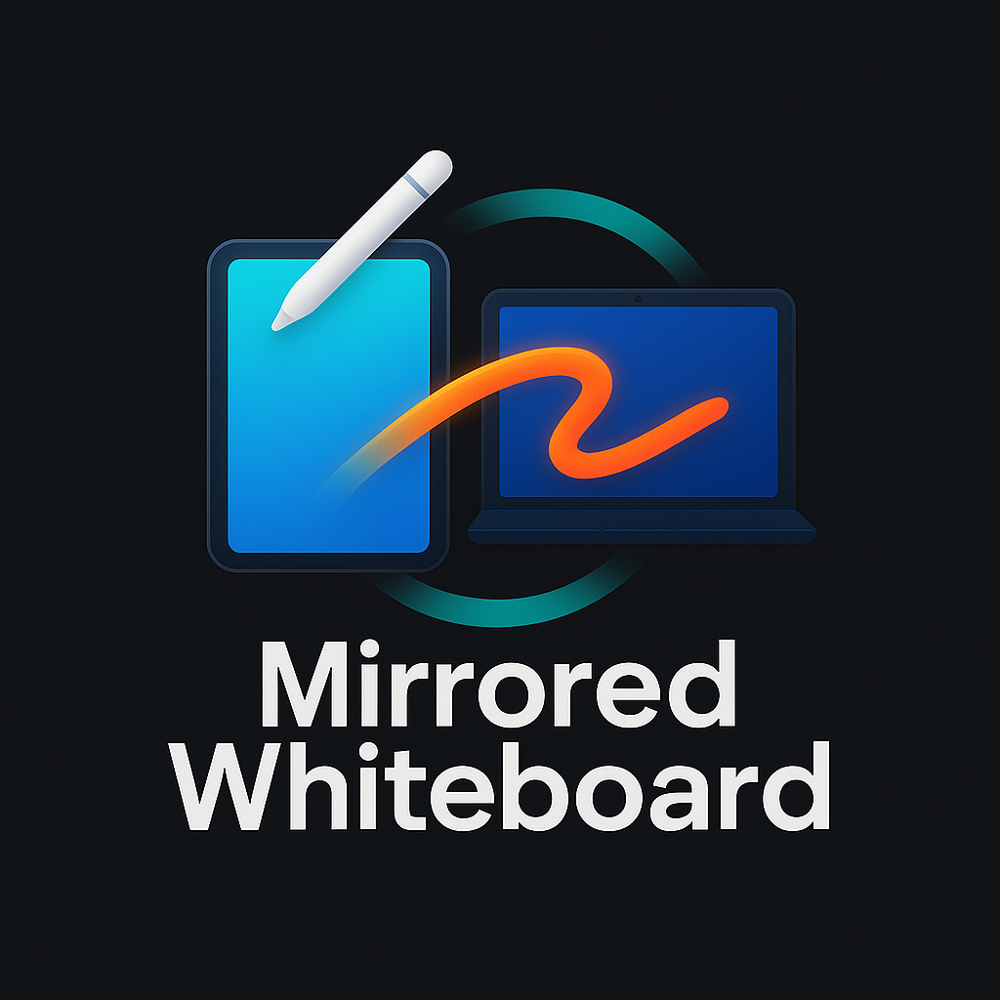

# Mirrored Whiteboard App

[](https://github.com/your-username/mirrored-whiteboard-app) <!-- Replace with actual logo path if different or remove if no logo -->

**Draw on one screen, see it instantly mirrored on another! A simple, real-time collaborative whiteboard experience.**

<!--  --> <!-- Add a screenshot or GIF later -->

## ✨ Features

*   **Real-time Drawing:** Sketch, draw, and write on a digital canvas.
*   **Instant Mirroring:** Open a separate "mirror" view that perfectly reflects the drawing canvas in real-time. Ideal for presentations, teaching, or collaborative sessions where one person draws and others watch.
*   **Simple Interface:** Clean and intuitive user interface built with React.
*   **Fast Development:** Leverages Vite for a speedy development experience.
*   **Modern Backend:** Powered by Deno for a secure and efficient server.

## 🤔 How it Works

The application likely uses WebSockets to transmit drawing data from the main drawing page (`/draw`) to any connected mirror pages (`/mirror`). As you draw on the canvas, the strokes are captured, sent to the server, and broadcasted to all mirror clients, ensuring a low-latency reflection of your work.

## 🚀 Getting Started

### Prerequisites

*   [Deno](https://docs.deno.com/runtime/manual/getting_started/installation) installed on your system.

### Installation & Running

1.  **Clone the repository:**
    ```bash
    git clone https://github.com/your-username/mirrored-whiteboard-app.git # Replace with your repo URL
    cd mirrored-whiteboard-app
    ```

2.  **Install dependencies (caches remote modules):**
    ```bash
    deno cache server/main.ts client/src/main.tsx
    # Alternatively, running `deno task dev` will also cache dependencies.
    ```

3.  **Run the development server:**
    This starts Vite for the frontend and the Deno backend server concurrently.
    ```bash
    deno task dev
    ```
    *   The drawing interface will be available at `http://localhost:xxxx/draw` (check terminal for Vite port, often 5173).
    *   The mirror view will be available at `http://localhost:xxxx/mirror`.

4.  **Build for Production:**
    ```bash
    deno task build
    ```

5.  **Run the production server:**
    Serves the optimized frontend build using the Deno server.
    ```bash
    deno task serve
    ```
    *   Access the app at `http://localhost:8090/draw` and `http://localhost:8090/mirror`.

## Deno Tasks (`deno.json`)

The `deno.json` file defines the tasks used for development, building, and serving. Here's an example structure:

```jsonc
// deno.json (Example Structure)
{
  "tasks": {
    "dev": "...", // Command to run Vite dev server (likely involves `vite`)
    "build": "...", // Command to build the client app (likely `vite build`)
    "serve": "deno run --allow-net --allow-read server/main.ts", // Command to run the production Deno server
    "test": "deno test -A" // Command to run tests (if defined)
  },
  "compilerOptions": {
    "jsx": "react-jsx",
    "jsxImportSource": "react"
  },
  "imports": {
    // Project dependencies listed here
    "react": "npm:react@^18.2.0",
    "react-dom/client": "npm:react-dom@^18.2.0/client",
    // ... other dependencies like oak, vite plugins, etc.
  }
  // Potentially an "importMap" key as well
}
```

## 🛠️ Usage

1.  Start the application using `deno task dev`.
2.  Open your browser and navigate to `http://localhost:xxxx/draw` (check the terminal for the exact Vite port). This is your drawing canvas.
3.  Open another browser tab or window and navigate to `http://localhost:xxxx/mirror`.
4.  Start drawing on the `/draw` page. You should see your strokes appear in real-time on the `/mirror` page.

## 💻 Technology Stack

*   **Frontend:** React, TypeScript, Tailwind CSS (based on project files)
*   **Build Tool:** Vite
*   **Backend:** Deno, Oak (likely, based on previous README)
*   **Real-time Communication:** WebSockets (Likely required for mirroring)

## Project Structure

```
.
├── client/         # React Frontend Code (Vite project)
│   ├── public/     # Static assets (like logo.png)
│   └── src/        # Source files (Components, Pages, CSS)
│       ├── pages/
│       │   ├── DrawPage.tsx
│       │   └── MirrorPage.tsx
│       ├── App.tsx     # Main App component (routing)
│       └── main.tsx    # Client entry point
├── server/         # Deno Backend Code
│   ├── util/       # Server utilities
│   └── main.ts     # Server entry point
├── .gitignore
├── deno.json       # Deno configuration (tasks, imports)
├── deno.lock       # Dependency lock file
├── LICENSE
├── README.md       # This file
└── vite.config.ts  # Vite configuration
```

## 🤝 Contributing

Contributions are welcome! Please feel free to open an issue or submit a pull request if you have ideas for improvements or bug fixes.

1.  Fork the Project
2.  Create your Feature Branch (`git checkout -b feature/AmazingFeature`)
3.  Commit your Changes (`git commit -m 'Add some AmazingFeature'`)
4.  Push to the Branch (`git push origin feature/AmazingFeature`)
5.  Open a Pull Request

## 📄 License

Distributed under the MIT License. See `LICENSE` for more information.
